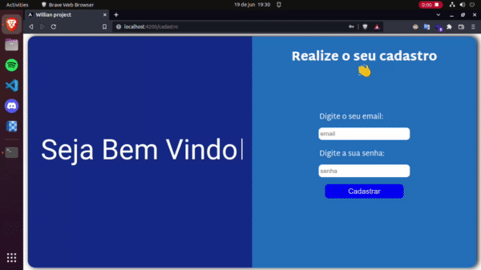
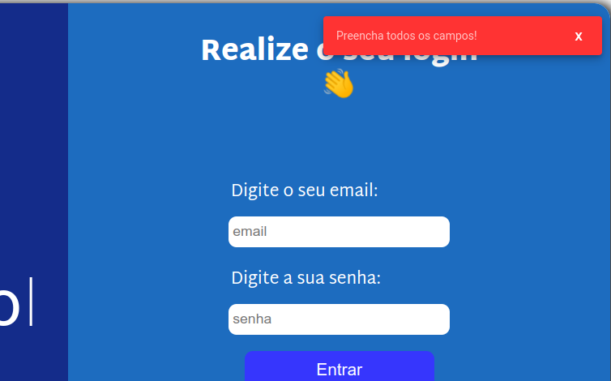
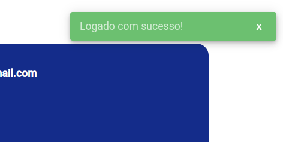
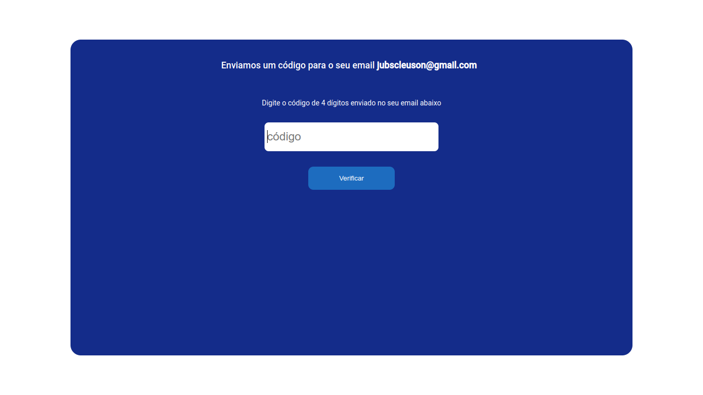

<table align="center">
<tr>
<td align="center" width="9999">

# Sistema de autenticação



*Authenticator systems for your application*

</td>
</tr>
</table>

***Características:***
```ts
{
    author: "Willian cavalcanti Coelho",
    about: "Website com o objetivo de associar com um backend de authenticação."
    framework: "angular",
    backend: "nestjs",
}
```

***Etc:***

- Para que fosse possivel um sistema de authenticação é necessário um **backend**, você pode acessar o backend desse projeto no seguinte repositório: https://github.com/Williancc1557/authenticator-api

- Para a construção desse site, utilizei meus simples conhecimentos do framework angular.

- O sistema vai verificar se seu token JWT está valido toda vez que entrar em uma nova página, caso não esteja vai ser redirecionado a pagina de login.

- O sistema vai mandar você para a página home caso tente entrar na página de login com o token ainda válido.

## Primeiros passos

Primeiramente, achei mais confortável criar primeiro o backend cujo o link está acima, iniciei criando as rotas necessária para que o frontend (ou seja, essa aplicação) que eu iria utilizar.

### Página de login

Comecei assim criando a **página de login** em que o resultado foi melhor do que eu esperava:


Essa página é um componente localizado na origem `src/app/page/auth/sign-in`, nessa página possui o container da esquerda que é de um titulo animado, e o da direita que são os campos para serem preenchidos.

A página é composta com tratamento de erros, apresentando todos os erros em formato de card no canto superior da tela, por exemplo:



Para aplicar esse card utilizei um módulo do angular chamado de `MatSnackBarModule`, criei duas funções para utilizar esse módulo, essas funções tem origem no `src/app/service/utils.service.ts`. Entretanto, tem uma função `showSnackBarSucess()` para caso seja um card positivo, ou seja, algo deu certo e uma função `showSnackBarError()` para algo falho. Para entender mais detalhadamente, observe o código <a href="https://github.com/Williancc1557/authenticator-page/blob/master/src/app/service/utils.service.ts">clicando aqui<a>, tentei deixar o mais claro possível.

Ao chamar a função **showSnackBarSucess()**, esse é o resultado:



Nesse caso utilizei o parâmetro "Logado com sucesso".

Também, fiz com que toda vez que a api for se comunicar com a **API** ela apresente uma tela de login que é um componente reutilizável, localizado na origem `src/components/utils/load`.

**Resultado:**


### Página de cadastro

A página de cadastro é totalmente baseada na de login, utilizando o mesmo componente de título e com o css quase idêntico, está localizada na origem `src/page/sign-up`.

Também utiliza os cards de erro e de sucesso, e também o de carregamento.


### Tela de confirmação de email

Como vamos ter certeza de que o email colocado para criar a conta, é realmente do usuário? Para isso fiz um sistema onde ele envia um código para o email que você utilizou para a criação da conta, ou seja, o usuário não vai ter acesso as páginas da aplicação sem antes ter verificado o seu email.



Coloque o código de 4 dígitos no bloco de texto e automaticamente ele vai validar seu código e liberar o seu email.


## Considerações finais


<div align="center">
    <p>
        Obrigado por ler minha doc, irei fazer mais projetos logo logo
    </p>
    
</div>